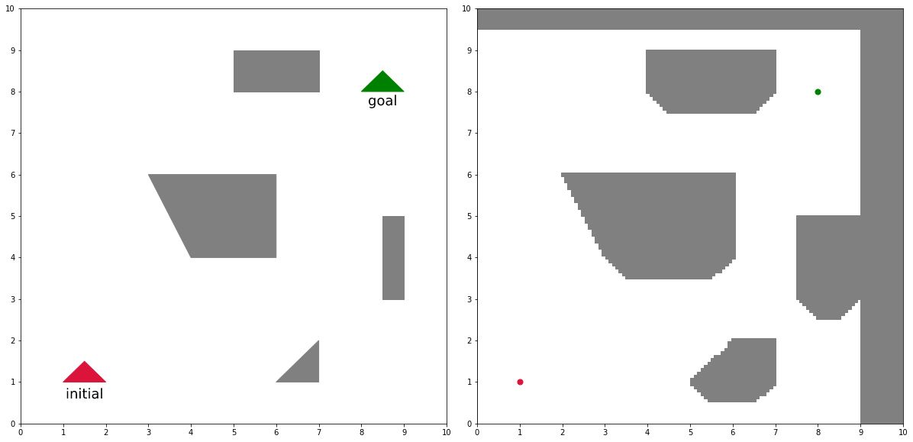

# rrt-star

#### Rapidly-exploring Random Tree (and RRT*) implementation for Rutgers University Intro to Computational Robotics CS 560 Fall 2021
 
Environment: initial and goal states for polygonal robot with polygonal obstacles (left) and corresponding configuration space (right)
  

  

  
Result: randomly generated solution path via implemented RRT (left) and randomly generated near-optimal solution path via RRT* (right)
  

  

